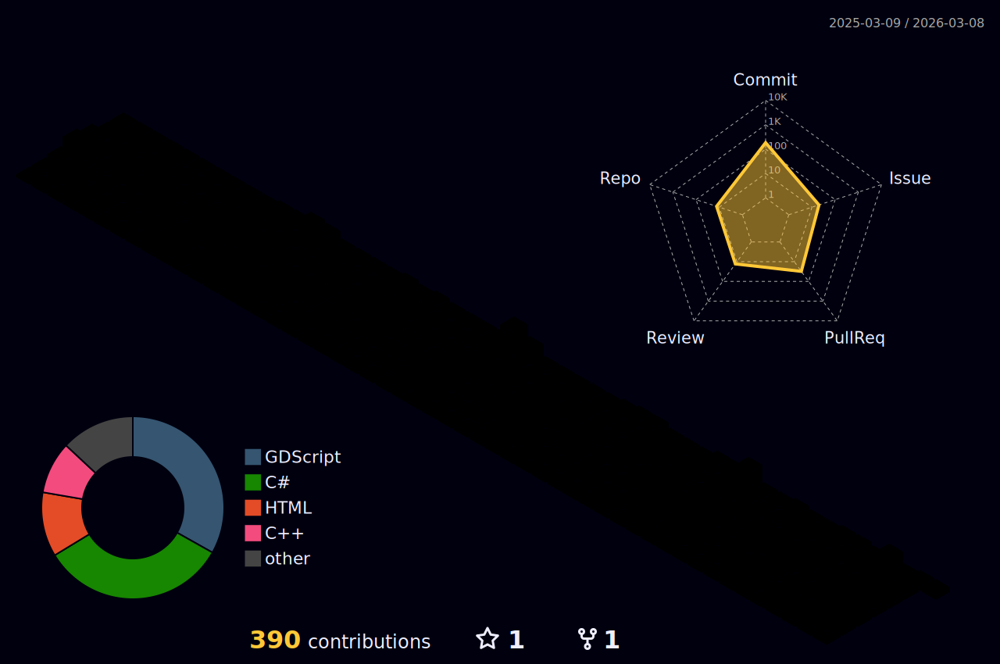

### **Featured Projects**

#### **Mobile Journal on Flutter**
#### **Hlebec Engine** – *Custom 3D Engine in C#/Silk.NET*
#### **SS14** - C# modding, server architecture, framework maker

### **What Drives Me ahhh moment**

- **Architecture-first** – Clean, scalable systems over quick fixes  
- **Challenge-oriented** – From legacy JS decoding to 3D graphics  
- **Full lifecycle** – Idea → Architecture → Implementation → Release → Maintenance  
- **Community & Mentoring** – Teaching Git, code reviews, YouTube tutorials  

> *"Everything in the world is possible—we're just not smart enough yet."*  
> – My approach to every technical challenge, like:

### You can write to me:)

